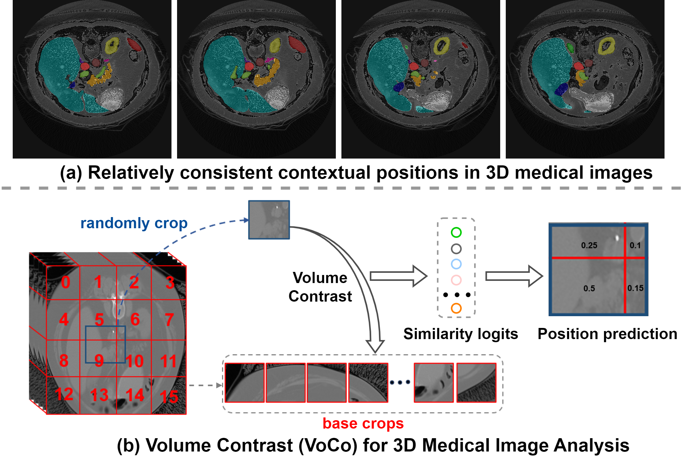

# VoCo
Code for CVPR 2024 paper, [**"VoCo: A Simple-yet-Effective Volume Contrastive Learning Framework for 3D Medical Image Analysis"**](https://arxiv.org/abs/2402.17300)

Authors: Linshan Wu, Jiaxin Zhuang, and <a href="https://scholar.google.com/citations?hl=en&user=Z_t5DjwAAAAJ">Hao Chen</a>

This work presents VoCo, a simple-yet-effective contrastive learning framework for pre-training a large scale 3D medical images. Our **10k CT images** pretraining checkpoints will soon be available.

## Abstract
Self-Supervised Learning (SSL) has demonstrated promising results in 3D medical image analysis. However, the lack of high-level semantics in pre-training still heavily hinders the performance of downstream tasks. We observe that 3D medical images contain relatively consistent contextual position information, i.e., consistent geometric relations between different organs, which leads to a potential way for us to learn consistent semantic representations in pre-training. In this paper, we propose a simple-yet-effective **Vo**lume **Co**ntrast (**VoCo**) framework to leverage the contextual position priors for pre-training. Specifically, we first generate a group of base crops from different regions while enforcing feature discrepancy among them, where we employ them as class assignments of different regions. Then, we randomly crop sub-volumes and predict them belonging to which class (located at which region) by contrasting their similarity to different base crops, which can be seen as predicting contextual positions of different sub-volumes. Through this pretext task, VoCo implicitly encodes the contextual position priors into model representations without the guidance of annotations, enabling us to effectively improve the performance of downstream tasks that require high-level semantics. Extensive experimental results on six downstream tasks demonstrate the superior effectiveness of VoCo.
