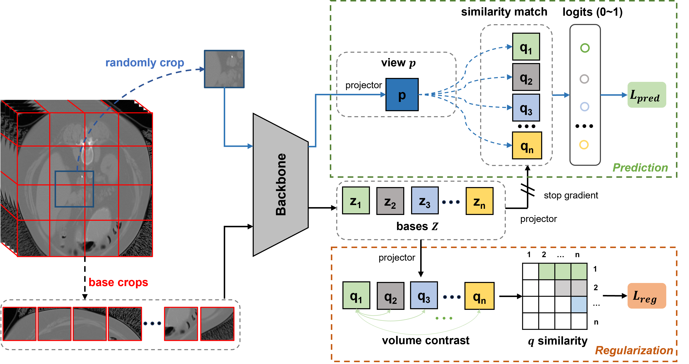
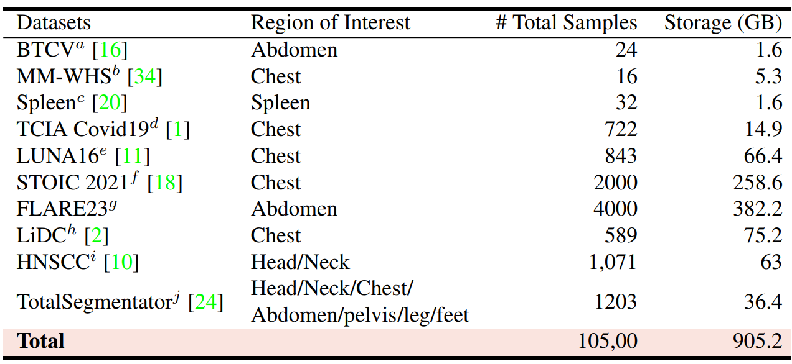

# VoCo

<a href="https://arxiv.org/abs/2402.17300"></a>
<a href='https://huggingface.co/datasets/Luffy503/VoCo-10k/tree/main'></a>

Code for CVPR 2024 paper, [**"VoCo: A Simple-yet-Effective Volume Contrastive Learning Framework for 3D Medical Image Analysis"**](https://arxiv.org/abs/2402.17300)

Authors: Linshan Wu, <a href="https://scholar.google.com/citations?user=PfM5gucAAAAJ&hl=en">Jiaxin Zhuang</a>, and <a href="https://scholar.google.com/citations?hl=en&user=Z_t5DjwAAAAJ">Hao Chen</a>

This work presents VoCo, a simple-yet-effective contrastive learning framework for pre-training large scale 3D medical images. Our **10k CT images pre-training** model are available. Our **100k CT images pre-training** models are comming soon!

## Abstract
Self-Supervised Learning (SSL) has demonstrated promising results in 3D medical image analysis. However, the lack of high-level semantics in pre-training still heavily hinders the performance of downstream tasks. We observe that 3D medical images contain relatively consistent contextual position information, i.e., consistent geometric relations between different organs, which leads to a potential way for us to learn consistent semantic representations in pre-training. In this paper, we propose a simple-yet-effective **Vo**lume **Co**ntrast (**VoCo**) framework to leverage the contextual position priors for pre-training. Specifically, we first generate a group of base crops from different regions while enforcing feature discrepancy among them, where we employ them as class assignments of different regions. Then, we randomly crop sub-volumes and predict them belonging to which class (located at which region) by contrasting their similarity to different base crops, which can be seen as predicting contextual positions of different sub-volumes. Through this pretext task, VoCo implicitly encodes the contextual position priors into model representations without the guidance of annotations, enabling us to effectively improve the performance of downstream tasks that require high-level semantics. Extensive experimental results on six downstream tasks demonstrate the superior effectiveness of VoCo.



## Performance
Our checkpoints 10K pre-trained checkpoint is available at [VoCo_10k.pt](https://www.dropbox.com/scl/fi/35ldfszlvw1ke4vr7xr5h/VoCo_10k.pt?rlkey=iu3muui9420soyjwlui79njmq&dl=0). More results are comming.
| Method | Dataset | Pre-trained model | Training log | BTCV |
|-|-:|:-:|:-:|:-:|
| **VoCo** | [10k CT](https://huggingface.co/datasets/Luffy503/VoCo-10k/tree/main) | [VoCo_10k.pt](https://www.dropbox.com/scl/fi/35ldfszlvw1ke4vr7xr5h/VoCo_10k.pt?rlkey=iu3muui9420soyjwlui79njmq&dl=0) | [Part of Pre-training log](https://www.dropbox.com/scl/fi/rmqy9n2gio5tptbhlt239/20240115_232208.txt?rlkey=0jmnpz3n77bb1b9r9wt9aqkrv&dl=0) | [84.51](https://www.dropbox.com/scl/fi/5eqxcmw7eefa3lvrczvri/model_btcv.pt?rlkey=2sobdex6lphyz7afqnzxdw0b0&dl=0) |

## Usage
### Load Pre-trained weight
```
import torch
import argparse
from monai.networks.nets import SwinUNETR

parser = argparse.ArgumentParser(description="Swin UNETR")
parser.add_argument("--roi_x", default=roi, type=int, help="roi size in x direction")
parser.add_argument("--roi_y", default=roi, type=int, help="roi size in y direction")
parser.add_argument("--roi_z", default=roi, type=int, help="roi size in z direction")
parser.add_argument("--feature_size", default=48, type=int, help="feature size")
parser.add_argument("--in_channels", default=1, type=int, help="number of input channels")
parser.add_argument("--out_channels", default=14, type=int, help="number of output channels")
parser.add_argument("--use_checkpoint", default=True, help="use gradient checkpointing to save memory")
args = parser.parse_args()
model = SwinUNETR(
        img_size=(args.roi_x, args.roi_y, args.roi_z),
        in_channels=args.in_channels,
        out_channels=args.out_channels,
        feature_size=args.feature_size,
        use_checkpoint=args.use_checkpoint,
        use_v2=True)
model_dict = torch.load(args.pretrained_checkpoint, map_location=torch.device('cpu'))
state_dict = model_dict
if "module." in list(state_dict.keys())[0]:
    print("Tag 'module.' found in state dict - fixing!")
    for key in list(state_dict.keys()):
        state_dict[key.replace("module.", "")] = state_dict.pop(key)
if "swin_vit" in list(state_dict.keys())[0]:
    print("Tag 'swin_vit' found in state dict - fixing!")
    for key in list(state_dict.keys()):
        state_dict[key.replace("swin_vit", "swinViT")] = state_dict.pop(key)
model.load_state_dict(state_dict, strict=False)
print("Using pretrained voco ema self-supervised Swin UNETR backbone weights !")
```
### Prepare Dataset
First, you need to download the pre-training dataset. The 10k dataset are all open-source and you can download yourself. Or you can download it in our [hugging face repo](https://huggingface.co/datasets/Luffy503/VoCo-10k/tree/main).

Note: 10k dataset is collected by Dr. <a href="https://scholar.google.com/citations?user=PfM5gucAAAAJ&hl=en">Jiaxin Zhuang</a>
```
├── data
    ├── BTCV
    ├── TCIAcovid19
    ├── Luna16-jx
    ├── stoic21
    ├── Totalsegmentator_dataset
    ├── Flare23
    ├── LiDC
    └── HNSCC_convert_v1
```
### Pre-Training
(1) Note that in this repo, we present the version of our 10k pre-training, thus some details may be different to our paper.

(2) To accerlate the training, we use "Persistentdataset" to pre-cache dataset, which requires extra storage. It is important in our codes. If you don't have enough storage, you can change it back in "utils/data_utils.py".

To pre-train: 
```bash 
sh train.sh
```
### Finetune
Our finetune codes will soon be available, or you can directly use the codes in [MONAI](https://github.com/Project-MONAI/research-contributions).

More finetune implementation are in preparation!
## Acknowledgement
We thank [MONAI](https://github.com/Project-MONAI/research-contributions) for part of their codes.
## Citation ✏️ 📄
If you find this repo useful for your research, please consider citing the paper as follows:

```
@InProceedings{voco,
    author    = {Wu, Linshan and Zhuang, Jiaxin and Chen, Hao},
    title     = {VoCo: A Simple-yet-Effective Volume Contrastive Learning Framework for 3D Medical Image Analysis},
    booktitle = {Proceedings of the IEEE/CVF Conference on Computer Vision and Pattern Recognition (CVPR)},
    month     = {June},
    year      = {2024},
    pages     = {22873-22882}
}
```
